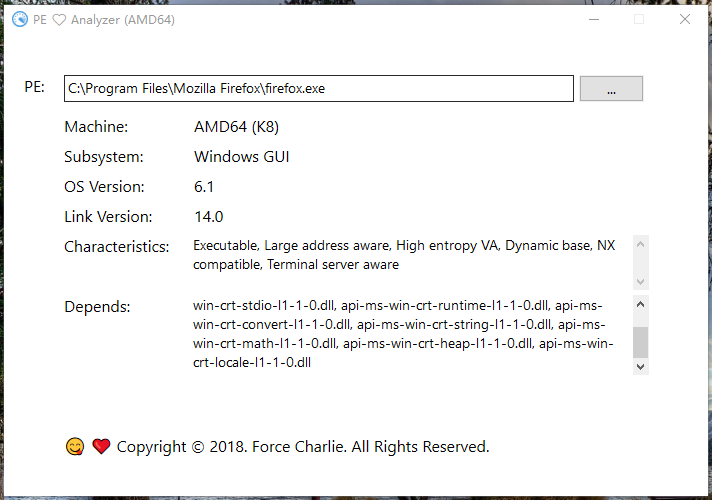

# PE ❤ Analyzer

On Windows,Executable (image) files are structured according to the Portable Executable (PE) format.  

However, People usually do not know what operating system to run on the PE file directly, 

PE Analyzer is a simple utility tool ,  this parse PE file information,Look Signature,Machine, Subsystem, Characteristics, 
Link Version, and OS Version. Entry Point.

## Build

Must Visual Studio 2013 or later, C++11 support allow, and ATL header has included.     
Recommend Visual Studio 2013 Community , or Visual Studio 2015 Community    

Click PEAnalyzer.sln ,select menu Build -> Build Solution

Use MSbuild build Release win32:    
>msbuild PEAnalyzer.sln /t:Build /p:Configuration=Release     

Win64:
>msbuild PEAnalyzer.sln /t:Build /p:Configuration=Release /p:Platform=x64

The features of this program that uses the Direct2D, you need to run on Windows 7 SP1 or later

## Usage

Click 'Find' button,select file, Or Drag File to Edit Control

## License

This tool use MIT License

Copyright &copy; 2019 Force Charlie, All Rights Reserved.    
